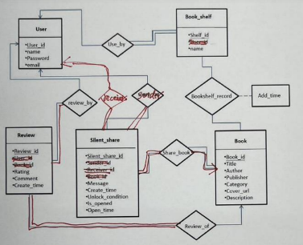

# Project report 3

#### 組別：Team 19
#### 組員：藍琬茜、黃佩珊、廖芷嫺

## 1. 系統內容功能詳細敘述
本系統主要涵蓋以下功能：
 - 使用者註冊與Email登入: 支援使用者使用帳號或是電子郵件註冊及登入，以保障安全性。
 - 個人書籍管理: 可依照個人喜好新增、刪除及瀏覽收藏書籍，同時提供多個書架進行分類。
 - 書籍評分與評論: 用者可以對收藏的書籍進行評分與撰寫短評，同時系統可以顯示每本書的平均評分與使用者的個人評價。
 - 靜音分享推薦書籍: 可選擇一次分享一至五本書(暫定)給指定朋友，並設定分享開啟條件，包括：指定日期（如生日）、延遲幾天後自動開啟等。
## 2. 系統功能實作規劃
 - 流程圖 : 將繪製使用者註冊、登入、書籍收藏、書架分類、書籍評分、靜音分享等功能流程，說明資料流與使用邏輯。
 - 介面設計 : 設計首頁、書架管理頁、書籍詳情頁、評分與留言介面、靜音分享設定頁與分享接收頁，確保操作直覺與介面一致性。

## 3. 預定工作分配
 - 組員1: 黃佩珊 | 前端頁面設計（登入、書櫃、評論）
 - 組員2: 藍琬茜 | 資料庫連接與CRUD操作（MySQL + PHP）
 - 組員3: 廖芷嫺 | 後端邏輯（PHP 控制流程）
 - 全員 | 資料庫設計與整合（包括DDL撰寫、ER圖轉換、報告撰寫與GitHub維護）
## 4. report 2修改內容
 - 